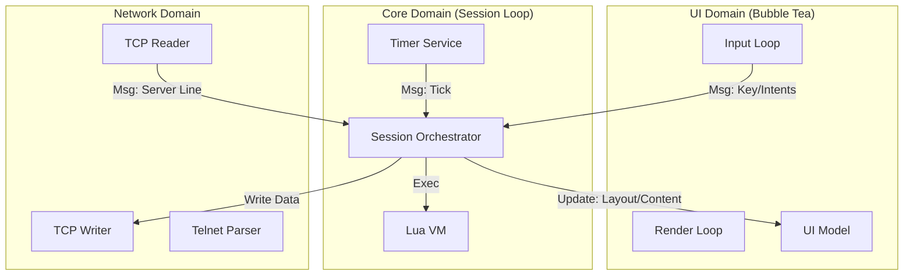

# Rune Architecture

Rune is a modern, highly scriptable MUD client written in Go. Its architecture is defined by a strict separation between **Mechanism** (Go) and **Policy** (Lua).

The core design philosophy aligns with tools like Neovim or WezTerm: the binary provides a high-performance, concurrent runtime and rendering engine, while the user experience, layout, and game logic are defined in Lua scripts.

## 1. Core Philosophy: Mechanism vs. Policy

- **Mechanism (Go):** Handles concurrency, TCP/Telnet protocol parsing, TUI rendering, timer scheduling, and file I/O. It knows *how* to draw a list of items or establish a socket connection, but it doesn't determine *when* to do so.
- **Policy (Lua):** Handles keybindings, layout configuration, aliases, triggers, and UI logic. It decides *what* to draw and *how* to react to user input.

### Example

- **Go** provides a generic "Picker" UI component that can display a list and filter it.
- **Lua** decides that `Ctrl+R` opens that picker, populates it with command history, and defines what happens when an item is selected.

## 2. System Overview

## 2.1 The Session (The Orchestrator)

The `Session` struct is the heart of the application. It owns the main event loop.

- **Responsibility:** It serializes all logic. Network events, user input, and timers are all channeled into the Session loop.
- **Thread Safety:** Because all logic (including Lua execution) happens sequentially in this loop, Lua scripts do not need locks.
- **State:** Owns the Lua Engine, Network Client, and Timer Service.

## 2.2 The UI (The Dumb Terminal)

The UI layer (built with Bubble Tea) is deliberately "dumb."

- **No Logic:** It does not know what "Slash Mode" or "History Search" is.
- **Push Architecture:** It renders based entirely on state snapshots pushed to it by the Session.
- **Outbound:** It sends generic intents (for example `ExecuteBindMsg`, `SetInputMsg`) back to the Session via a buffered channel.

## 2.3 The Lua Engine

A wrapper around gopher-lua.

- **Segregated Interfaces (ISP):** The Engine depends on six focused service interfaces rather than a monolithic host: `UIService`, `NetworkService`, `TimerService`, `SystemService`, `HistoryService`, and `StateService`. This keeps the Lua implementation decoupled and testable.
- **Reactivity:** The Engine updates a global `rune.state` table whenever system state changes (connection, scroll position), allowing scripts to reactively render UI elements.

## 3. UI Architecture: The "Push" Model

To solve thread-safety issues between the UI rendering loop and the Lua execution loop, Rune uses a strict Push/Snapshot model.

### 3.1 Layout and Bars

User scripts define layouts and status bars using Lua functions.

- **Definition:** `rune.ui.bar("status", function(width) ... end)`
- **Trigger:** A ticker in the Session runs every 250ms (or on state change).
- **Execution:** The Session executes the Lua function to generate the bar content string.
- **Push:** The Session sends an `UpdateBarsMsg` map to the UI.
- **Render:** The UI reads from this map during its `View()` cycle.

This ensures the UI never calls into Lua directly, preventing race conditions.

### 3.2 Key Bindings

- **Registration:** Lua registers a bind: `rune.bind("ctrl+r", fn)`.
- **Sync:** The Session pushes a `map[string]bool` of bound keys to the UI (`UpdateBindsMsg`).
- **Detection:** When a key is pressed, the UI checks this map.
  - **If Bound:** The UI suppresses default behavior and sends an `ExecuteBindMsg` to the Session.
  - **If Unbound:** The UI handles it normally (for example, typing text).

### 3.3 The Generic Picker

Rune avoids hardcoded UI modals. Instead, it exposes a single, configurable Picker component.

- **Modal Mode:** Used for History/Aliases. The Picker traps focus and keys.
- **Linked Mode:** Used for Slash Commands. The Picker sits passively above the input line, filtering based on what the user types.

**Flow:**

1. Lua calls `rune.ui.picker.show({ items=..., filter_prefix="/" })`.
2. Session generates a callback ID and pushes a `ShowPickerMsg` to the UI.
3. UI renders the picker.
4. User selects an item.
5. UI sends `PickerSelectMsg` (with the ID) back to Session.
6. Session executes the stored Lua callback.

## 4. Networking & Telnet

Rune implements a bespoke Telnet parser (`network/parser.go`) ported from `libmudtelnet`.

- **State Machine:** Handles negotiation (WILL/WONT/DO/DONT) and subnegotiation.
- **Compatibility Table:** Tracks the state of every Telnet option to prevent negotiation loops.
- **Output Buffer:** A smart buffer that handles incoming byte streams, detecting lines, and managing prompts (terminated vs. unterminated) based on GA/EOR signals.

## 5. Design Patterns Used

### 5.1 The Adapter Pattern

The `ui/tui.go` file acts as an adapter, converting the Bubble Tea `Update`/`View` model into the channel-based API expected by the Session.

### 5.2 The Observer Pattern (Reactive State)

The `rune.state` table in Lua serves as an observable state store. Go pushes updates to it; Lua reads from it during render cycles.

### 5.3 The Command Pattern

Interaction between UI and Session is message-passing (commands), not function calls. This allows the Session to process UI requests asynchronously and safely.

## 6. Future Extensibility

- New UI widgets can be added to `ui/components` and exposed via `Show...Msg` without changing the engine core.
- A headless mode can be implemented by providing an alternate `mud.UI` interface implementation.
- Multiple concurrent sessions (tabs) are supported since no global state is shared.

## 7. Directory Structure

- `cmd/`: Entry points (`rune`, `layout-test`)
- `lua/`: Scripting engine and API definitions
- `mud/`: Core interfaces and types
- `network/`: TCP and Telnet logic
- `session/`: Main application controller
- `ui/`: Bubble Tea TUI implementation  
  - `components/`: Reusable widgets (Input, Picker, Status)  
  - `layout/`: Layout definitions

