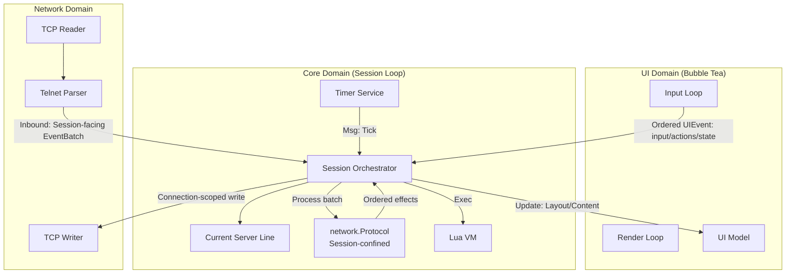

# Rune Architecture

Rune is a modern, highly scriptable MUD client written in Go. Its architecture is defined by a strict separation between **Mechanism** (Go) and **Policy** (Lua).

The core design philosophy aligns with tools like Neovim or WezTerm: the binary provides a high-performance, concurrent runtime and rendering engine, while the user experience, layout, and game logic are defined in Lua scripts.

## 1. Core Philosophy: Mechanism vs. Policy

- **Mechanism (Go):** Handles concurrency, TCP/Telnet protocol parsing, TUI rendering, timer scheduling, and file I/O. It knows *how* to draw a list of items or establish a socket connection, but it doesn't determine *when* to do so.
- **Policy (Lua):** Handles keybindings, layout configuration, aliases,
  triggers, and application UI policy. It decides *what* to draw and *how* the
  application reacts to user input.

### Example

- **Go** provides a generic "Picker" UI component that can display a list and filter it.
- **Lua** decides that `Ctrl+R` opens that picker, populates it with command history, and defines what happens when an item is selected.

## 2. System Overview

## 2.1 The Session (The Orchestrator)

The `Session` struct is the heart of the application. It owns the main event loop.

- **Responsibility:** It serializes application-state changes and Lua calls.
  Network events, UI events, and timers all enter through the Session loop.
- **Thread Safety:** Because Session and Lua mutations happen sequentially in
  this loop, Lua scripts do not need locks. Network I/O and UI rendering keep
  their own goroutines without sharing that mutable state.
- **State:** Owns the Lua Engine, Network Client, Timer Service, and the one
  mutable current server line.

### The Inner Loop

`Session.processEvents` (`session/session.go`) is the single dispatch point. Its `select` is the complete inventory of what can happen in the client - each channel is a typed lane with one handler:

| Lane | Carries | Handler |
|---|---|---|
| `ui.Events()` | One ordered stream of `ui.UIEvent`: draft changes, `SubmissionMsg`, binds, picker results, and view state | `handleUIEvent` |
| `net.Inbound()` | One owned `network.EventBatch` or disconnect, tagged with its connection ID (`network.Inbound`) | `handleInbound` |
| `timerEvents` | Due Lua timers | `engine.OnTimer` |
| `barTicker` | 250ms bar repaint tick | `pushBarUpdates` |
| `internalEvents` | Typed results and deferred work owned by Session (`connectFinished`, `httpFinished`, `reloadRequested`) | `handleInternalEvent` |

Session-owned background work publishes inert data through `internalEvents`; it
never sends closures that hide later state mutations. Session applies those
results on its event loop like every other event. Each lane is FIFO; ordering
across lanes is undefined. The single UI lane also preserves order among all
accepted UI events: for example, a draft change cannot be observed after the
submission made from that draft. To answer "what can this client react to?",
read the `select`.

## 2.2 The UI (Presentation and Input Mechanics)

The UI layer (built with Bubble Tea) owns terminal interaction mechanics, not
application policy.

- **Interaction mechanics:** It owns editing, compose mode, picker and search
  modes, viewport navigation, wrapping, and render batching.
- **Application policy:** Lua decides which binds, bars, layouts, triggers, and
  commands exist. The UI never calls Lua directly.
- **Push Architecture:** It renders based entirely on state snapshots pushed to it by the Session.
- **Ordered events:** It sends typed actions and state changes (for example
  `ExecuteBindMsg`, `InputChangedMsg`, `PickerSelectMsg`, and `SubmissionMsg`)
  through one bounded `Events()` channel.

Bubble Tea's update/render goroutine never blocks waiting for Session to drain
that channel. Every event uses the same non-blocking admission check. Once a
`SubmissionMsg` is admitted, the UI may clear its local draft because Session
owns the immutable snapshot; Session clears its tracked draft and calls the
`input_changed` hook before processing the submission. If the queue is full,
the UI leaves a submission in the editor and shows a warning. Other rejected
events are dropped with a warning. This keeps the UI responsive without
silently losing typed input.

## 2.3 The Lua Engine

A wrapper around the scripting seam in `script/`, which the Lunar backend
implements by default and the LuaJIT backend implements under `-tags luajit`.

- **Single Host interface:** The Engine depends on one `lua.Host` interface (`lua/host.go`). Session implements it, with the methods grouped by service area across `session/lua_*.go` (network, ui, timers, system, history, session, store, log, state). Tests substitute a mock Host.
- **Reactivity:** The Engine updates a global `rune.state` table whenever system state changes (connection, scroll position), allowing scripts to reactively render UI elements.

## 3. UI Architecture: The "Push" Model

To solve thread-safety issues between the UI rendering loop and the Lua execution loop, Rune uses a strict Push/Snapshot model.

### 3.1 Layout and Bars

User scripts define layouts and status bars using Lua functions.

- **Definition:** `rune.ui.bar("status", function(width) ... end)`
- **Trigger:** A ticker in the Session runs every 250ms (or on state change).
- **Execution:** The Session executes the Lua function to generate the bar content string.
- **Push:** The Session sends an `UpdateBarsMsg` map to the UI.
- **Render:** The UI reads from this map during its `View()` cycle.

This ensures the UI never calls into Lua directly, preventing race conditions.

### 3.2 Key Bindings

- **Registration:** Lua registers a bind: `rune.bind("ctrl+r", fn)`.
- **Sync:** The Session pushes a `map[string]bool` of bound keys to the UI (`UpdateBindsMsg`).
- **Detection:** When a key is pressed, the UI checks this map.
  - **If Bound:** The UI suppresses default behavior and sends an `ExecuteBindMsg` to the Session.
  - **If Unbound:** The UI handles it normally (for example, typing text).

### 3.3 The Generic Picker

Rune avoids hardcoded UI modals. Instead, it exposes a single, configurable Picker component.

- **Modal Mode:** Used for History/Aliases. The Picker traps focus and keys.
- **Inline Mode:** Used for slash-command completion. The picker sits above the input line and filters as the user types.

**Flow:**

1. Lua calls `rune.ui.picker.show({ items=..., mode="inline" })`.
2. Session generates a callback ID and pushes a `ShowPickerMsg` to the UI.
3. UI renders the picker.
4. User selects an item.
5. UI sends `PickerSelectMsg` (with the ID) back to Session.
6. Session executes the stored Lua callback.

## 4. Networking & Telnet

Rune implements a bespoke Telnet parser (`network/telnet.go`) ported from
`libmudtelnet`. Networking has two explicit ownership domains:

- **Transport:** `TCPClient` owns TCP/TLS, the read and write goroutines, Telnet
  framing, and MCCP read-source changes. It consumes transport-local MCCP
  activation events, then publishes any remaining Session-facing events from
  one `Parser.Receive` result as one deep-owned `EventBatch`; an
  MCCP-only result publishes no batch. Events are never expanded into
  independently scheduled channel messages. An `Inbound` value attaches a
  batch, or a disconnect, to the connection that produced it. The batch also
  carries the transport's TLS status for identity negotiation.
- **Protocol:** Session creates one `network.Protocol` per connection and is
  the only goroutine that calls it. The reducer owns application-visible Telnet
  state such as local echo, GMCP, identity negotiation, and NAWS. Its
  `Process` method walks a complete batch synchronously in wire order and emits
  effects back while Session is handling that batch.

MCCP activation remains a transport concern because decompression must begin
before the next socket read. The transport consumes the activation marker and
preserves every other event in its original batch order. All socket writes go
through the connection's one writer. Session supplies the expected connection
ID to `SendLine` or `SendFrame`, so checking the active connection and queuing
the write is one operation.

### 4.1 Server text lifecycle

TCP read boundaries do not delimit lines or confirm prompts. `Username:` may be
a complete login prompt or the first part of a longer line. A batch boundary
only gives Rune a safe point to display its current provisional view; Rune does
not use a timer or prompt pattern to guess the final classification.

The parser records ordered Telnet facts: application data, commands,
negotiation transitions, subnegotiations, and required reply frames. It does
not assemble lines or classify prompts. `network.Protocol` translates those
facts into ordered effects such as server data, GA, EOR, GMCP messages, and
outbound Telnet frames. Session consumes each effect before `Process` advances
to the next one, so protocol state changes, Lua callbacks, and writes all see
one coherent wire order.

Session owns `serverLine`, a `serverLineBuffer` and the sole mutable server-line
assembler. Its event-loop goroutine joins data across batches and recognizes
CRLF, LFCR, LF, and bare CR. CR terminates the line immediately, including at
the end of an event or batch; an optional following LF is swallowed even when
it arrives in a later event or batch. Because the buffer and Protocol are
confined to Session, neither needs a mutex.

Session turns those facts into Rune events:

| Observation | Session behavior |
|---|---|
| A batch ends with changed, unterminated text | Replace the prompt overlay and call `prompt(line, false)`. This cumulative observation may repeat across batches. |
| A line delimiter arrives | Consume the current line through `output` exactly once. Ordinary and multi-line triggers see it. |
| GA/EOR arrives in the same batch as changed, unterminated text | Consume non-empty current text through `prompt(line, true)` without first exposing it as `confirmed = false`. |
| GA/EOR arrives in a later batch | Consume the previously observed line through `prompt(line, true)`. Empty markers do nothing. |
| The user submits anything | Finish the current line before history, local echo, input hooks, aliases, or slash commands. |
| A programmatic game send is accepted | Queue the write immediately. Finish the current line after the active `network.EventBatch` has installed its final rewrite or gag. |

Prompt and output trigger channels are exclusive. A partial observation never
runs ordinary triggers or changes span state. A GA/EOR-confirmed prompt closes
open spans before prompt hooks run. Finishing a current line on submission or
an accepted game send commits its already processed overlay and closes spans;
it does not run the prompt hook again. Without an active current line,
unrelated span state is unchanged.

Every submission is a display boundary regardless of local echo, whether an
input hook consumes it, whether it is a slash command, connection state, or a
later send failure. Separately, Lua actions from aliases, triggers, timers, and
other callbacks finish the current line only when their game send is accepted
by Network. During inbound processing, `activeNetworkEventBatchState` points to
the temporary `networkEventBatchState` for one `network.EventBatch`. That state
records whether the server tail changed and whether an accepted send owes a
visual line finish. Only after the complete batch has run does Session publish
any remaining provisional prompt and perform the owed finish. Multiple
accepted sends still finish the line once. This keeps the wire write immediate
while allowing the callback that sent it to rewrite or gag the visible line
before it is committed. A failed game send and protocol traffic such as GMCP,
NAWS, and Telnet negotiation do not finish server text.

If the current text was really the beginning of a fragmented ordinary line,
submitting input or accepting a game send commits that visible prefix; later
server text begins a new line. This is the explicit trade-off for immediate
partial-line display without a timer or per-MUD prompt pattern. Connect and
disconnect discard the current line and open spans without firing them.

### 4.2 Ordered negotiation and GMCP

Protocol effects are handled as they are produced; Session does not prequeue
all replies or collapse a batch to its final negotiation state. For example,
if one batch contains `WILL GMCP`, a GMCP payload, and `WONT GMCP`, Rune queues
`DO GMCP`, marks GMCP active, runs `gmcp_enabled` (whose Lua policy queues
`Core.Hello` and `Core.Supports.Set`), dispatches the payload and any handler
writes, then queues `DONT GMCP` and marks GMCP inactive. Splitting those bytes
across arbitrary TCP reads has the same ordered result.

The Protocol reducer is the authoritative source for whether GMCP and local
echo are active. Session asks it to build an outbound GMCP frame and rejects
the request when that connection has not negotiated GMCP. Parser compatibility
state remains private framing bookkeeping; application code does not query it
as protocol state.

## 5. Design Patterns Used

### 5.1 The Adapter Pattern

The `ui/tui/tui.go` file acts as an adapter, converting the Bubble Tea `Update`/`View` model into the channel-based API expected by the Session.

### 5.2 The Observer Pattern (Reactive State)

The `rune.state` table in Lua serves as an observable state store. Go pushes updates to it; Lua reads from it during render cycles.

### 5.3 Typed Message Passing

Work entering Session is data, not a callback into hidden code. The UI publishes
`UIEvent` values and Session-owned workers publish `internalEvent` completion
values. The Session loop interprets both and serializes every application-state
or Lua mutation. Dial and HTTP work share the Session's Run context, so stopping
the Session also stops producers waiting to publish a result. HTTP completions
carry the Lua generation that created their callback; a result from before
`/reload` cannot claim a reused callback ID in the rebuilt VM.

## 6. Future Extensibility

- New UI widgets can be added to `ui/tui/widget` and exposed via `Show...Msg` without changing the engine core.
- A headless mode can be implemented by providing an alternate `ui.UI` interface implementation.
- Multiple concurrent sessions (tabs) are supported since no global state is shared.

## 7. Directory Structure

- `cmd/rune/`: Entry point
- `config/`: Config dir resolution (XDG/APPDATA)
- `input/`: Input submission types and cursor conversions
- `lua/`: Scripting engine, `rune._*` primitive registration, embedded Lua core (`lua/core/`)
- `network/`: TCP and Telnet logic
- `session/`: Main application controller (implements `lua.Host`)
- `text/`: Line type, ANSI stripper, degraded-path colors
- `timer/`: Timer scheduling service
- `version/`: Version number, single-sourced for `/version` and TTYPE/MNES
- `ui/`: UI interface and messages
  - `tui/`: Bubble Tea implementation
  - `tui/widget/`: Reusable widgets (Input, Picker, Viewport, Pane, Bar)
