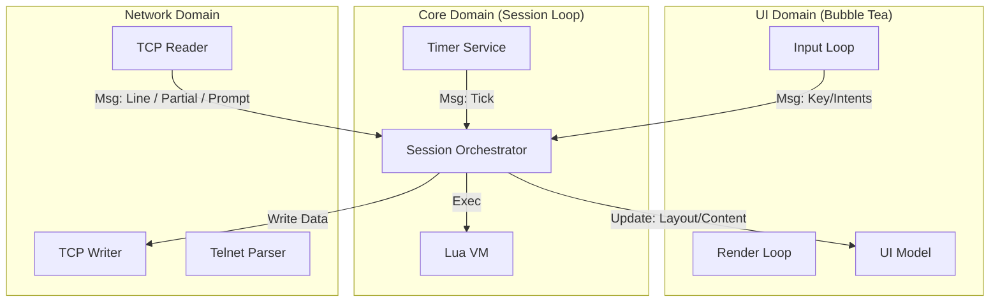

# Rune Architecture

Rune is a modern, highly scriptable MUD client written in Go. Its architecture is defined by a strict separation between **Mechanism** (Go) and **Policy** (Lua).

The core design philosophy aligns with tools like Neovim or WezTerm: the binary provides a high-performance, concurrent runtime and rendering engine, while the user experience, layout, and game logic are defined in Lua scripts.

## 1. Core Philosophy: Mechanism vs. Policy

- **Mechanism (Go):** Handles concurrency, TCP/Telnet protocol parsing, TUI rendering, timer scheduling, and file I/O. It knows *how* to draw a list of items or establish a socket connection, but it doesn't determine *when* to do so.
- **Policy (Lua):** Handles keybindings, layout configuration, aliases, triggers, and UI logic. It decides *what* to draw and *how* to react to user input.

### Example

- **Go** provides a generic "Picker" UI component that can display a list and filter it.
- **Lua** decides that `Ctrl+R` opens that picker, populates it with command history, and defines what happens when an item is selected.

## 2. System Overview

## 2.1 The Session (The Orchestrator)

The `Session` struct is the heart of the application. It owns the main event loop.

- **Responsibility:** It serializes all logic. Network events, user input, and timers are all channeled into the Session loop.
- **Thread Safety:** Because all logic (including Lua execution) happens sequentially in this loop, Lua scripts do not need locks.
- **State:** Owns the Lua Engine, Network Client, and Timer Service.

### The Inner Loop

`Session.processEvents` (`session/session.go`) is the single dispatch point. Its `select` is the complete inventory of what can happen in the client - each channel is a typed lane with one handler:

| Lane | Carries | Handler |
|---|---|---|
| `ui.Outbound()` | UI intents (keys, resize, picker, input edits) | `handleUIMessage` |
| `ui.Input()` | Submitted input (`input.Submission`, command or verbatim) | `handleSubmission` |
| `net.Output()` | Server lines, prompts, GMCP, disconnect (`network.Output`) | `handleNetworkOutput` |
| `timerEvents` | Due Lua timers | `engine.OnTimer` |
| `barTicker` | 250ms bar repaint tick | `pushBarUpdates` |
| `asyncResults` | Continuations of Session's own async work (dial, HTTP, deferred reload), as `func()` | run the closure |

Lanes carrying cross-domain data are typed; `asyncResults` is deliberately not - it carries the second half of Session methods that had to leave the goroutine for a blocking step, and only the `session` package may send on it. Each lane is FIFO; ordering across lanes is undefined. To answer "what can this client react to?", read the `select`.

## 2.2 The UI (The Dumb Terminal)

The UI layer (built with Bubble Tea) is deliberately "dumb."

- **No Logic:** It does not know what "Slash Mode" or "History Search" is.
- **Push Architecture:** It renders based entirely on state snapshots pushed to it by the Session.
- **Outbound:** It sends generic intents (for example `ExecuteBindMsg`, `SetInputMsg`) back to the Session via a buffered channel.

## 2.3 The Lua Engine

A wrapper around the scripting seam in `script/`, which the Lunar backend
implements by default and the LuaJIT backend implements under `-tags luajit`.

- **Single Host interface:** The Engine depends on one `lua.Host` interface (`lua/host.go`). Session implements it, with the methods grouped by service area across `session/lua_*.go` (network, ui, timers, system, history, session, store, log, state). Tests substitute a mock Host.
- **Reactivity:** The Engine updates a global `rune.state` table whenever system state changes (connection, scroll position), allowing scripts to reactively render UI elements.

## 3. UI Architecture: The "Push" Model

To solve thread-safety issues between the UI rendering loop and the Lua execution loop, Rune uses a strict Push/Snapshot model.

### 3.1 Layout and Bars

User scripts define layouts and status bars using Lua functions.

- **Definition:** `rune.ui.bar("status", function(width) ... end)`
- **Trigger:** A ticker in the Session runs every 250ms (or on state change).
- **Execution:** The Session executes the Lua function to generate the bar content string.
- **Push:** The Session sends an `UpdateBarsMsg` map to the UI.
- **Render:** The UI reads from this map during its `View()` cycle.

This ensures the UI never calls into Lua directly, preventing race conditions.

### 3.2 Key Bindings

- **Registration:** Lua registers a bind: `rune.bind("ctrl+r", fn)`.
- **Sync:** The Session pushes a `map[string]bool` of bound keys to the UI (`UpdateBindsMsg`).
- **Detection:** When a key is pressed, the UI checks this map.
  - **If Bound:** The UI suppresses default behavior and sends an `ExecuteBindMsg` to the Session.
  - **If Unbound:** The UI handles it normally (for example, typing text).

### 3.3 The Generic Picker

Rune avoids hardcoded UI modals. Instead, it exposes a single, configurable Picker component.

- **Modal Mode:** Used for History/Aliases. The Picker traps focus and keys.
- **Linked Mode:** Used for Slash Commands. The Picker sits passively above the input line, filtering based on what the user types.

**Flow:**

1. Lua calls `rune.ui.picker.show({ items=..., filter_prefix="/" })`.
2. Session generates a callback ID and pushes a `ShowPickerMsg` to the UI.
3. UI renders the picker.
4. User selects an item.
5. UI sends `PickerSelectMsg` (with the ID) back to Session.
6. Session executes the stored Lua callback.

## 4. Networking & Telnet

Rune implements a bespoke Telnet parser (`network/telnet.go`) ported from `libmudtelnet`.

- **State Machine:** Handles negotiation (WILL/WONT/DO/DONT) and subnegotiation.
- **Compatibility Table:** Tracks the state of every Telnet option to prevent negotiation loops.
- **Output Buffer:** A fragmentation-safe accumulator that reports three facts: delimiter-terminated lines, non-consuming snapshots of the unfinished tail, and tails consumed by GA/EOR.

### 4.1 Server text lifecycle

TCP read boundaries do not carry meaning. If the current buffer contains
`Username:`, it may be a complete login prompt with no terminator or merely the
first part of a longer line. Rune does not use a timeout or a configured prompt
pattern to guess which one it is.

The network layer reports only what it knows:

| Event | Meaning | Consumes the accumulator |
|---|---|---|
| `OutputLine` | Text ended by CRLF, LFCR, LF, or bare CR | yes |
| `OutputPartial` | Snapshot of the current unfinished tail | no |
| `OutputPrompt` | GA/EOR ended a nonempty current tail | yes |

Partials are displayed immediately in the prompt overlay. They may grow across
reads and the same bytes may later arrive once as an `OutputLine` or
`OutputPrompt`. Lua receives overlay changes through `prompt_update`; the
confirmation boolean is false for `OutputPartial` and true for `OutputPrompt`.
Ordinary trigger actions consume only `OutputLine`. Prompt triggers opt into
the speculative overlay path. As a presentation safeguard, declarative
`gag = true` output patterns are checked read-only against unconfirmed
partials, without firing actions or changing trigger state. A GA/EOR marker
received with no current tail has no text to report, so it produces no output
event.

When later server text supersedes the overlay, an unconfirmed partial is
replaced without being committed because it may be a preview of that text. A
confirmed prompt is first committed to scrollback because GA/EOR made it a
separate record. This applies even when the following record first arrives as
another partial.

Only explicit boundaries may finalize multiline trigger state: a nonempty tail
terminated by GA/EOR, a user submission, or an outbound command that closes an
active prompt-overlay epoch. A partial, an empty GA/EOR marker, and an
unrelated outbound command never change span state. Before writing any outbound
line, the network writer publishes an ordered boundary and discards the
unfinished accumulator, so an automated response to `Username:` cannot be
joined to the following `Password:`. This is the unavoidable no-timer
trade-off: if a command is sent during an ordinary line split, the text before
that send belongs to the previous accumulator epoch. Connecting,
disconnecting, and reloading discard unfinished spans without firing them.

## 5. Design Patterns Used

### 5.1 The Adapter Pattern

The `ui/tui/tui.go` file acts as an adapter, converting the Bubble Tea `Update`/`View` model into the channel-based API expected by the Session.

### 5.2 The Observer Pattern (Reactive State)

The `rune.state` table in Lua serves as an observable state store. Go pushes updates to it; Lua reads from it during render cycles.

### 5.3 The Command Pattern

Interaction between UI and Session is message-passing (commands), not function calls. This allows the Session to process UI requests asynchronously and safely.

## 6. Future Extensibility

- New UI widgets can be added to `ui/tui/widget` and exposed via `Show...Msg` without changing the engine core.
- A headless mode can be implemented by providing an alternate `ui.UI` interface implementation.
- Multiple concurrent sessions (tabs) are supported since no global state is shared.

## 7. Directory Structure

- `cmd/rune/`: Entry point
- `config/`: Config dir resolution (XDG/APPDATA)
- `input/`: Input submission types and cursor conversions
- `lua/`: Scripting engine, `rune._*` primitive registration, embedded Lua core (`lua/core/`)
- `network/`: TCP and Telnet logic
- `session/`: Main application controller (implements `lua.Host`)
- `text/`: Line type, ANSI stripper, degraded-path colors
- `timer/`: Timer scheduling service
- `version/`: Version number, single-sourced for `/version` and TTYPE/MNES
- `ui/`: UI interface and messages
  - `tui/`: Bubble Tea implementation
  - `tui/widget/`: Reusable widgets (Input, Picker, Viewport, Pane, Bar)
